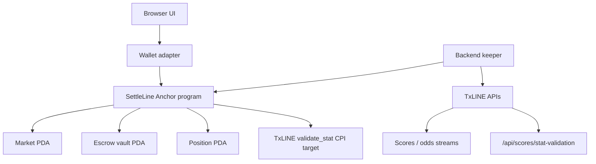

# Architecture

SettleLine is built as a Solana dApp with an off-chain TxLINE relay.

## On-Chain

The Anchor program in `programs/settleline` handles:

- Market creation.
- User deposits.
- Position account creation.
- Escrow vault custody.
- Market close and settlement.
- Winner claims.
- TxLINE proof gate inputs.

The current scaffold includes a local consistency gate for TxLINE receipt fields. The production upgrade is to replace that local gate in `settle_market` with a CPI into TxLINE `validate_stat`, passing the proof objects returned by `/api/scores/stat-validation`.

## Off-Chain

The backend in `backend/src` handles:

- TxLINE credentials.
- Fixture and score snapshots.
- Score and odds SSE streams.
- Validation proof retrieval.
- Settlement instruction planning.

The backend does not decide who wins. It retrieves proof material and submits a transaction. The program remains the settlement authority.

## Devnet Constants

- TxLINE devnet API: `https://txline-dev.txodds.com/api/`
- TxLINE devnet program: `6pW64gN1s2uqjHkn1unFeEjAwJkPGHoppGvS715wyP2J`
- SettleLine program: generated by `anchor keys sync` and deployed by `anchor deploy`
